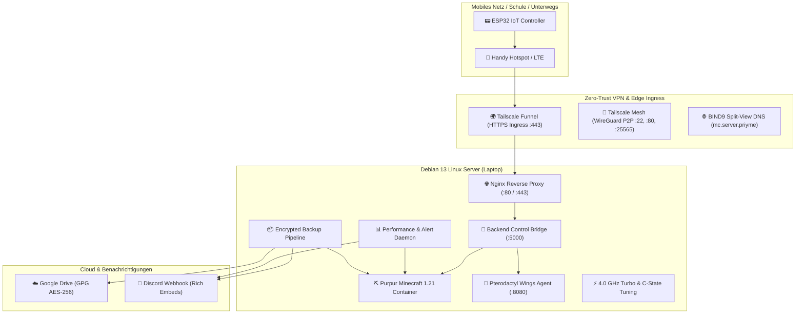

# 🎮 Minecraft Infrastructure & IoT Hardware Ecosystem

[](https://debian.org)
[](https://purpurmc.org)
[](https://espressif.com)
[](https://tailscale.com)
[](https://www.isc.org/bind/)
[](https://gnupg.org)
[](LICENSE)

Eine professionelle, produktionsreife IT-Infrastruktur für Game-Server-Hosting, Disaster Recovery, Performance-Monitoring und physische IoT-Fernsteuerung über einen externen ESP32-Mikrocontroller.

Dieses Projekt vereint moderne **DevOps-Konzepte** (Docker, Systemd, Cgroups v2, REST-APIs), **Datensicherheit & Disaster Recovery** (GPG AES-256 Verschlüsselung, Cloud-Sync via Rclone), **Zero-Trust-Netzwerke** (Tailscale Mesh VPN & TLS Funnel, BIND9 Split-View DNS) sowie **Embedded Systems** (ESP32 C/C++, Hardware-Interrupts, I2C-Display und LED-Ampel).

---

## 🏗️ Systemübersicht



---

## 📁 Repository-Struktur

```text
minecraft-iot-server/
├── README.md                      # Gesamtdokumentation & Projektübersicht
├── .gitignore                     # Schutz vor Commits sensibler Dateien & Logs
├── scripts/                       # Diagnose- und Wartungsskripte
│   └── healthcheck.sh             # Automatische 16-Punkte Systemdiagnose
├── docs/                          # Vertiefende technische Dokumentationen
│   ├── ARCHITECTURE.md            # Detaillierte Architektur, Datenflüsse & Port-Mapping
│   ├── HARDWARE_ESP32.md          # Schaltpläne, Pinouts, Entprellung & Display-Modi
│   ├── TAILSCALE_SETUP.md         # Zero-Trust VPN, Funnel Ingress, Split-DNS & Remote SSH
│   ├── BACKUP_PIPELINE.md         # Save-Flush-Garantie, AES-256 & Disaster Recovery
│   ├── PTERODACTYL_REVERSE_PROXY.md # Multi-Domain Reverse Proxy & Trusted Proxies Setup
│   ├── PTERODACTYL_NODE_WEBSOCKET_PNA.md # Lösung für WebSocket PNA Blockaden
│   ├── CLIENT_NETWORK_TROUBLESHOOTING.md # Leitfaden für WLAN-Wechsel & KI-Diagnose-Prompt
│   └── LAGEBERICHT.md             # Vollständiger Systembericht und Komponentencheck
├── esp32-firmware/                # Embedded C++ Firmware für den ESP32
│   ├── MinecraftServerMonitor.ino # Hauptsketch (OLED/LCD, Taster, Ampel, WiFiMulti)
│   └── README.md                  # Flash-Anleitung, Libraries & DTR/RTS Boot-Trap Fix
├── backend-bridge/                # REST-API Schnittstelle für den ESP32
│   ├── mc-control-service.py      # Python HTTP-Daemon (Cgroups RAM, RCON Pipeline)
│   ├── mc-control.service         # Systemd Unit File
│   ├── fix_node_fqdn.sql          # SQL-Patch für Pterodactyl Node-FQDN
│   └── README.md                  # API-Endpunkte, curl-Tests & Einrichtung
├── backup-pipeline/               # Disaster Recovery & Cloud Backup
│   ├── backup.sh                  # Haupt-Backupskript mit RCON-Lock & GPG-Verschlüsselung
│   ├── restore.sh                 # Interaktives Wiederherstellungsskript
│   ├── setup_rclone.sh            # Rclone Google Drive Einrichtungsassistent
│   ├── rcon_cli.py                # Zero-Dependency Python RCON Client
│   ├── send_discord.py            # Rich Discord Embed Notifier
│   ├── backup.conf.example        # Bereinigte Konfigurationsvorlage
│   ├── systemd/                   # Systemd Timer (täglich 03:30 Uhr) & Service
│   └── README.md                  # Backup-Optionen, Retention Policy & Dry-Run
├── perf-monitoring/               # Echtzeitüberwachung & Alerting
│   ├── mc-perf-monitor.py         # 20s Polling Daemon mit 5s/1m/5m TPS Durchschnitt
│   ├── monitor.conf.example       # Konfigurationsvorlage für Webhooks & Schwellwerte
│   ├── mc-perf-monitor.service    # Systemd Hintergrunddienst
│   └── README.md                  # Schwellwertkonfiguration & Cooldown-Logik
├── system-tuning/                 # Linux Host-Optimierung für Game-Server
│   ├── set-cpu-performance.sh     # Performance Governor, 4.0 GHz Lock, C-States Off
│   ├── cpu-performance.service    # Systemd Boot-Service
│   └── README.md                  # Laptop Server Setup (Lid-Close, Thermals)
└── dns-bind9/                     # Lokaler DNS & Split-View für weltweiten Zugriff
    ├── named.conf.split-view.example # BIND9 View-Konfiguration (ACL Erkennung)
    ├── named.conf.local           # Standard Heimnetz-Zonen
    ├── named.conf.options         # Interface- & Forwarder-Optionen
    ├── zones/                     # DNS-Zonendateien (60s TTL, LAN & Tailscale)
    └── nginx/                     # Pterodactyl Nginx Reverse-Proxy Vorlage
```

---

## 🌟 Hauptkomponenten im Detail

### 1. 🌐 BIND9 Split-View DNS & Tailscale
- **Automatische Client-Erkennung:** Tailscale-Clients (`100.64.0.0/10`) erhalten die VPN-IP `100.111.45.61`; lokale Heimnetz-Clients erhalten `192.168.0.33`.
- **Niedrige 60s TTL:** Verhindert veraltete DNS-Caches auf Windows/Mobilgeräten beim Wechsel zwischen Heim-WLAN und mobilen Hotspots.
- **Weltweite Erreichbarkeit:** `panel.server.priyme` und `mc.server.priyme` funktionieren nahtlos über Tailscale ohne offene Router-Ports.

### 2. 📟 ESP32 IoT Hardware Controller
- **Anzeige:** SSD1306 0.96" OLED (128x64) oder HD44780 16x2 LCD Display.
- **Ampel:** 3-farbige LED-Ampel (Grün = TPS ≥ 19.5, Gelb = Booting/Warnung, Rot = Offline/Lag).
- **Steuerung:** 3 Taster (Start, Stop, Google Drive Backup) mit Hardware-Interrupts (`FALLING`) und 300ms Software-Entprellung.
- **Netzwerk:** Automatisches Roaming via `WiFiMulti` (Handy-Hotspot für unterwegs, lokales WLAN zuhause) mit automatischem Fallback zwischen lokalem HTTP (`:5000`) und weltweitem HTTPS Funnel.

### 3. 🔌 Backend Control Bridge (`mc-control-service`)
- Ultraschneller Cgroups v2 RAM-Reader (`/sys/fs/cgroup/.../memory.current`), Antwortzeit ca. **30 Millisekunden** (statt 1,5 Sekunden bei `docker stats`).
- Single-Socket RCON Multiplexing: Fragt TPS und Spielerzahlen über eine einzige TCP-Verbindung ab, um Socket-Timeouts zu eliminieren.
- Direkte Integration mit der Pterodactyl Wings Agent API für saubere Server-Power-Cycles.

### 4. 📦 Verschlüsselte Google Drive Backup Pipeline
- **Zero-Downtime Save-Flush:** Schützt Spielstände vor Chunk-Boundary-Tearing durch sequentielles `save-off` $\rightarrow$ `save-all flush` $\rightarrow$ `save-on`.
- **Datenbanksicherung:** Automatischer Hot-Dump der MariaDB Pterodactyl-Panel-Datenbanken (`mysqldump`).
- **GPG AES-256:** Clientseitige symmetrische Verschlüsselung vor dem Cloud-Upload.
- **Rclone Integration:** Direkter Upload nach Google Drive mit automatischer Retention Policy (5 lokale Backups, 14 Tage Cloud-Speicher).
- **Automatisierung:** Nativer Systemd-Timer jeden Tag um **03:30 Uhr**.

### 5. 🩺 Automatische Systemdiagnose (`healthcheck.sh`)
- Einzeiliges Diagnosetool zur Überprüfung von 16 Parametern (BIND9, Nginx, Wings, Minecraft, IoT Bridge, Docker, Tailscale, Funnel HTTPS, DNS Views).

---

## 🚀 Schnellstart & Diagnose

### Systemzustand prüfen:
```bash
./scripts/healthcheck.sh
```

### Fernwartung via SSH über Tailscale:
```bash
ssh prime@100.111.45.61
```

---

## 🔒 Sicherheitshinweis

Alle sensiblen Daten (Discord Webhooks, MariaDB-Passwörter, RCON-Passwörter, Tailscale-Funnel-Tokens und GPG-Passphrasen) wurden in Vorlagendateien (`.example`) ausgelagert. Die Datei `.gitignore` verhindert, dass echte Zugangsdaten versehentlich in Git-Repositories eingecheckt werden.
