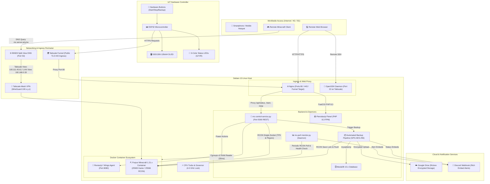

# 🏗️ System Architecture & Data Flow

This document details the multi-tiered architecture of the Minecraft Server & IoT Ecosystem.

---

## 📐 High-Level Architecture Diagram

---

## 🔌 Socket & Port Mapping Table

| Port | Protokoll | Service / Komponente | Erreichbarkeit | Zweck |
| :--- | :--- | :--- | :--- | :--- |
| **22** | TCP | OpenSSH Daemon | Tailscale (`100.x.y.z`) & LAN | Fernwartung der Konsole von überall |
| **53** | UDP/TCP | BIND9 DNS Server | Tailscale & LAN | Split-View DNS Auflösung (`server.priyme`) |
| **80** | TCP | Nginx Webserver | Alle Schnittstellen & Funnel | Pterodactyl Webpanel & IoT Reverse Proxy |
| **443** | TCP | Nginx / Funnel TLS | LAN (`192.168.0.33`) & Funnel | HTTPS Ingress mit Let's Encrypt |
| **5000** | TCP | `mc-control-service.py` | Localhost (Nginx Reverse Proxy) | REST API für ESP32 Hardware-Controller |
| **8080** | TCP | Reviactyl / Wings Agent | Alle Schnittstellen | WebSocket Live-Konsole & Node API |
| **2022** | TCP | Wings SFTP Server | Alle Schnittstellen | Sicherer Datei-Upload/-Download |
| **25565** | TCP/UDP | Minecraft (Purpur 1.21) | Alle Schnittstellen (0.0.0.0) | Minecraft Game Client Port |
| **25566** | TCP | Minecraft RCON | Localhost (127.0.0.1) | Remote Console Befehle für Automatisierung |

---

## 🔄 Data Flows & Protocols

### 1. External Monitoring & Control Loop
1. The **ESP32** checks connectivity via `WiFiMulti`.
2. Every 2500ms, it dispatches an HTTP(S) GET request to `/api/status`:
   - If connected to the mobile hotspot, requests are routed securely via **Tailscale Funnel HTTPS** (`https://prime.tail923f91.ts.net/api/status`).
   - If connected to the local home network, requests hit the low-latency direct IP (`http://192.168.0.33/api/status`).
3. The **Backend Control Bridge** handles `/api/status`:
   - Reads memory from `/sys/fs/cgroup/system.slice/docker-*.scope/memory.current` (bypassing slow `docker stats`).
   - Executes a single-socket dual-query RCON packet for `tps` and `list`.
   - Returns a lightweight JSON payload.
4. The ESP32 parses JSON using `ArduinoJson`, updates the OLED display, and sets the LED Ampel states.

### 2. Hardware Interrupt Actions
- **START Pressed:** ESP32 invokes `/start` $\rightarrow$ Control Bridge triggers Wings Agent `/api/servers/{id}/power` (action: `start`).
- **STOP Pressed:** ESP32 invokes `/stop` $\rightarrow$ Control Bridge triggers graceful RCON `stop` followed by Wings Agent shutdown.
- **BACKUP Pressed:** ESP32 invokes `/backup` $\rightarrow$ Control Bridge spawns `/usr/local/bin/minecraft-backup` in the background (returns `409 BUSY` if an existing backup is running).

### 3. Backup Pipeline & Consistency
- Executes `rcon save-off` and `rcon save-all flush` to ensure all chunks in memory are written to disk without tearing.
- Performs hot database dump (`mysqldump`) for Pterodactyl databases.
- Archives server directory with file exclusion filters.
- Encrypts archive using symmetric GPG (AES-256 cipher).
- Uploads encrypted bundle to Google Drive via Rclone.
- Executes `rcon save-on`.
- Cleans up older local files (retention: 5) and remote files (retention: 14 days).
- Posts completion embed to Discord.

### 4. Performance Monitoring & Alerting
- Continuously polls TPS, container RAM, and process state every 20 seconds.
- Automatically calculates 5s, 1m, and 5m rolling averages.
- Sends rich Discord embeds on threshold breach (Warn / Critical / Crash / Recovery) with a 10-minute cooldown timer.
