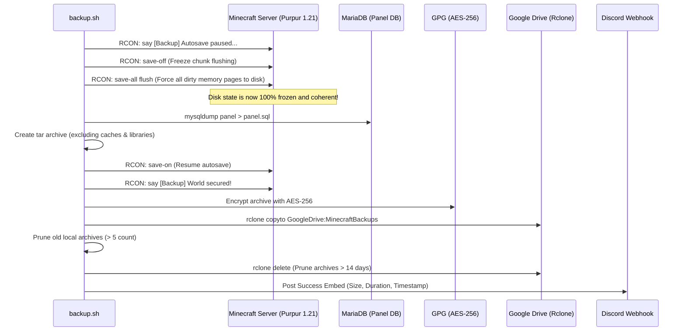

# 📦 Backup Pipeline & Disaster Recovery Specification

This document details the automated backup architecture, data consistency guarantees, encryption, and recovery procedures.

---

## 🛡️ Consistency Guarantee: The Save-Flush Cycle

Minecraft servers hold world state, entity data, and player inventory in RAM before periodically flushing chunks to disk. Creating a raw filesystem backup without server coordination causes chunk boundary corruption (world tearing).

To prevent this, the backup pipeline executes a zero-downtime 3-phase lock via RCON:



---

## 🔒 Security: Client-Side GPG AES-256

Data stored in third-party cloud providers is vulnerable if credentials are breached. 
The backup pipeline uses symmetric AES-256 encryption via GPG before uploading:
- Command: `gpg --batch --yes --symmetric --cipher-algo AES256 --passphrase "$GPG_PASSPHRASE" ...`
- Resulting file: `mc_backup_YYYY-MM-DD_HH-MM-SS.tar.gz.gpg`
- Raw world files, player UUID data, server properties, and MySQL database dumps are unreadable without the passphrase.

---

## 🔄 Disaster Recovery Procedures

In the event of hardware failure, world corruption, or ransomware:

### 1. Listing Available Backups
```bash
./restore.sh --list
```
Displays all backups present in the local directory and in the Google Drive remote folder.

### 2. Downloading & Restoring from Cloud
```bash
# Download specific backup archive from Google Drive:
./restore.sh --download mc_backup_2026-10-02_19-30-00.tar.gz.gpg

# Restore world files and databases into target directory:
sudo ./restore.sh /home/prime/backups/mc_backup_2026-10-02_19-30-00.tar.gz.gpg --restore-db
```

### 3. Dry-Run Verification
To verify backup integrity without modifying live directories:
```bash
sudo ./backup.sh --dry-run
```
